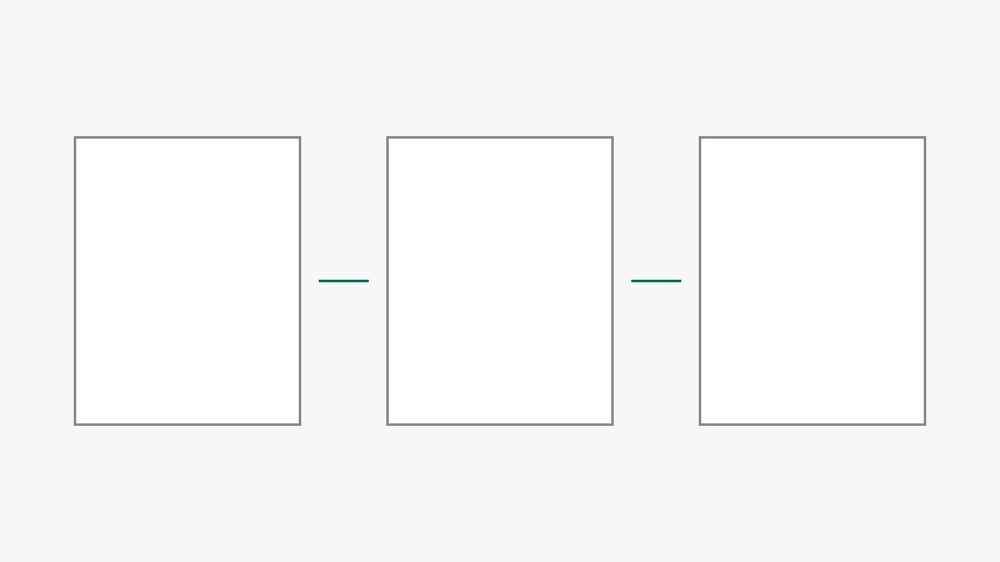

# lecture-template

강의 PPT를 인터랙티브 웹 강의로 옮기기 위한 GitHub 템플릿 저장소입니다.
현재 범위는 **Phase T-2: 공통 기능 승격 + 예시 골격**입니다. 실제 강의 콘텐츠는 없으며, 범용 슬라이더 위젯 예시가 포함되어 있습니다.
Phase 1은 별도 확인 후 시작합니다.

빌드 도구·번들러·npm 의존성·외부 CDN·웹폰트 다운로드가 없습니다.
이 저장소에서 복제한 각 강의 저장소 자체가 사이트 루트입니다.
예: `https://kimjinhyuk1984.github.io/ai-squat-king/`

## 새 강의 만드는 법

AI 코딩 도구의 단계별 작업 지시서는 [WORKFLOW.md](WORKFLOW.md)입니다. 복제한 저장소에서 `WORKFLOW.md의 1단계를 수행하라`처럼 지시하세요. 지정한 단계만 수행하며, 판단이 필요한 사항과 각 단계 종료 시에는 보고하고 멈춥니다.

1. GitHub에서 `lecture-template` 저장소의 **Use this template → Create a new repository**로 복제합니다. 예: `ai-squat-king`.
2. `data/site.js`의 `site.repo`를 복제한 저장소 이름으로 바꾸고, `levels[0]`의 제목·부제·킥커·시간·대상·난이도·태그·액센트를 채웁니다. 기본값은 단일 강의입니다. `otherLectures`도 필요에 맞게 바꿉니다.
3. `index.html`의 예시 섹션을 강의 내용으로 채웁니다. 히어로와 헤더의 강의 제목은 수정할 필요가 없습니다. 내비게이션은 `.lecture-section`의 `id`와 `h2`를 DOM에서 직접 수집해 만듭니다.
4. 강의별 인터랙션은 `assets/js/widgets.js`에 등록하고, 커스텀 CSS는 `assets/css/lecture.css`에만 작성합니다.
5. **Settings → Pages → Deploy from a branch → main / (root)**로 설정합니다. 루트의 빈 `.nojekyll`을 유지합니다.

최초 템플릿 저장소의 이름은 `lecture-template`으로 지정하고 **Settings → General → Template repository**를 켭니다.
현재 로컬 폴더 이름이 달라도 관계없습니다. 배포 경로에 저장소 이름을 하드코딩하지 않습니다.

## levels 스키마와 단일·다중 강의

`data/site.js`는 다음 네 블록을 선언합니다. 기존 `lecture` 객체는 사용하지 않습니다.

| 블록 | 역할 |
| --- | --- |
| `site: { title, subtitle, repo }` | 허브 제목·부제, 진행 기록을 구분하는 저장소 이름. repo는 링크 경로에 붙이지 않습니다. |
| `instructor` | 기존 선생님 정보. 템플릿에서 공통 관리합니다. |
| `levels` | 강의 메타 배열. 아래 필드를 각 원소에 지정합니다. |
| `otherLectures` | 다른 사이트의 강의 링크. 외부 절대 주소만 사용합니다. |

각 레벨은 `{ slug, badge, title, subtitle, kicker, duration, target, difficulty, tags, accent, emoji, cover, status }`입니다.
`cover`는 선택 사항이며 사이트 루트 기준 상대 이미지 경로입니다. `status`는 `ready` 또는 `coming`입니다.
`ready` 카드는 강의 링크이고 `coming` 카드는 준비 중 배지와 `aria-disabled`를 가진 비활성 카드입니다.

- **원소 1개**: 루트 `index.html`이 바로 강의입니다. 허브를 만들지 않습니다. `badge`는 빈 문자열로 두고 화면에서도 생략합니다. `slug`는 폴더/URL 선택에는 쓰지 않고 진도 저장용 고정 ID로만 씁니다. 제목을 바꿔도 기록이 남도록 slug는 유지하세요.
- **원소 2개 이상**: 루트에 허브와 레벨 카드가 자동 생성되며 기존 루트 예시 섹션은 숨겨집니다. 단일/다중 모드를 고르는 별도 플래그는 없습니다.
- **하위 강의 페이지**: 각 slug와 같은 폴더에 `index.html`을 복사하고 `<body data-level="intro">`처럼 해당 slug를 지정합니다. CSS·스크립트·본문 이미지 경로에는 `../`를 붙입니다. 예: `../assets/css/base.css`, `../data/site.js`.

다중 강의로 바꿀 때 파일·폴더를 만드는 일과 강의 내용을 채우는 일은 작성자가 합니다.
브라우저가 하위 HTML 파일을 생성하지는 않습니다. `ready`로 공개하기 전에 실제 `<slug>/index.html`이 있어야 합니다.
shared.js의 `currentLevel()`은 단일이면 첫 원소, 다중이면 body의 data-level과 같은 원소를 선택합니다.
`assetURL()`은 로드한 data/site.js의 위치로 사이트 루트를 계산해 선생님 사진·허브 표지·목록 복귀 링크를 처리합니다.
본문 HTML의 이미지 경로는 작성자가 페이지 깊이에 맞게 지정합니다. 기본 표지 설명은 “강의 제목 + 강의 표지”입니다.

## 조각 단위 발표 모드

읽기 모드에서는 문서가 원래 순서대로 보입니다. 발표 모드는 기존 DOM을 조각별로 옮겨 보여준 뒤 복원합니다.
예시 3개 섹션은 전체 15조각이며, 기본 발표에는 건너뛰기 조각 1개를 제외한 14조각이 표시됩니다.

| 속성 | 사용법 |
| --- | --- |
| `data-slide` | 조각 경계. 빈 값은 각 요소가 별도 조각입니다. 같은 섹션 안의 같은 비어 있지 않은 값은 한 조각으로 묶습니다. 중첩해서 지정하지 마세요. |
| `data-slide-title` | 섹션 제목 옆에 표시할 조각 제목. 그룹에서는 첫 마커의 제목을 사용합니다. |
| `data-slide-skip` | 기본 발표에서 제외. 그룹 안 하나에 붙어도 그룹 전체가 제외됩니다. S로 포함 여부를 바꿉니다. 읽기 모드에서는 숨기지 않습니다. |
| `data-slide-lines="3-5"` | 발표 중 표시할 코드 줄 범위(1부터 시작하는 양 끝 포함). pre 또는 코드를 참조하는 template에 지정합니다. 복사 버튼은 전체 원문을 복사합니다. |
| `data-slide-code="example-code"` | template에서 기존 pre의 id를 참조합니다. 원문을 중복 작성하지 않고 다른 범위를 발표합니다. |
| `data-slide-fit="contain"` | 이미지·위젯을 담는 조각의 비율을 유지해 축소합니다. 실제 이미지·위젯은 이 속성 없이도 감지하지만 예시에 명시했습니다. |
| `data-slide-preview="outline-code"` | 선택 사항. S로 제외 중에는 해당 id의 설명용 코드로 대체하며, S로 전체를 포함하면 원래 조각/범위로 돌아옵니다. 대체 pre의 data-slide-lines를 사용합니다. |

조각 표시가 없는 섹션은 섹션 전체가 한 조각입니다. 코드를 참조하는 예시는 다음과 같습니다.

```html
<pre id="example-code" data-code data-slide data-slide-lines="3-5"><code># 전체 원문 코드</code></pre>
<template data-slide data-slide-title="코드 앞부분" data-slide-code="example-code" data-slide-lines="1-2"></template>
<figure class="media-figure" data-slide data-slide-title="그림" data-slide-fit="contain">
  
  <figcaption>그림 설명</figcaption>
</figure>
```

| 키 | 동작 |
| --- | --- |
| `P` / 헤더 발표 버튼 | 진입·종료 |
| `Esc` | 종료 |
| `←`·`↑` / `PageUp` | 이전 조각 |
| `→`·`↓` / `PageDown` | 다음 조각 |
| `Shift + 방향키` | 이전/다음 표시 가능한 섹션의 첫 조각으로 점프 |
| `S` | 건너뛰기 조각 포함·제외 |
| `B` | 블랙아웃 켜기·끄기 |

모달이 열렸거나 입력 필드에 포커스가 있으면 단축키를 처리하지 않습니다.
발표 모드 진입 시 열린 햄버거 메뉴는 닫힙니다. 위젯의 방향키는 위젯이 사용합니다.
발표 제목은 44px, 본문은 28px, 코드·표는 24px입니다. 텍스트가 넘치면 본문 24px·코드 20px까지 조정합니다.
이미지·위젯 조각은 별도로 비율 축소합니다(위젯 축소 하한 60%). 그래도 넘치면 내용 스크롤과 안내를 표시합니다.
좁은 화면에서는 발표 내용도 스크롤할 수 있습니다. 교실 검증 기준은 1920×950이며 1920×1080에서도 사용할 수 있습니다.

### 넘침 검사

발표 모드에서 개발자 도구 콘솔에 `reportPresentationOverflow()`를 실행합니다.
현재 표시 대상 전체를 순회해 조각 컨테이너의 scrollHeight와 clientHeight를 비교하고,
넘치는 조각의 번호·섹션·제목·높이·넘침 픽셀·축소율을 반환합니다. 빈 배열 `[]`이면 넘침 0건입니다.
검사는 읽음 기록을 추가하지 않으며 현재 조각·스크롤 위치·포커스를 복원합니다.
건너뛰는 조각도 검사하려면 `S`로 포함한 뒤 다시 실행하세요. 이미지 로드와 위젯 마운트가 끝난 뒤 실행합니다.
넘침 안내가 나오면 내용을 더 작은 조각으로 나누세요. 검사는 세로 넘침 기준이며 긴 코드 줄은 코드블록 안에서 가로 스크롤됩니다.

## 로컬 실행과 오프라인 사용

프로젝트 루트에서 다음 명령을 실행한 뒤 `http://localhost:8000`을 엽니다.

```bash
python3 -m http.server 8000
```

Windows에서 `python3` 대신 `py`만 설치되어 있다면 `py -m http.server 8000`을 사용할 수 있습니다.
서버 없이 `index.html`을 더블클릭해 `file://`로 열어도 히어로·모달·테마·코드 표시가 동작합니다.
파일을 편집한 직후 이전 데이터가 보이면 `Ctrl+F5` (macOS: `Cmd+Shift+R`)로 정적 파일 캐시를 비우고 새로고침합니다.
사이트 데이터를 `window.SITE`에 선언하고 일반 `defer` 스크립트로 읽으므로 별도의 데이터 서버가 필요 없습니다.

자동 복사는 Clipboard API를 우선 사용하고, 차단되면 `execCommand("copy")`로 대체합니다.
브라우저가 둘 다 차단하면 실패 안내를 표시합니다. 코드를 선택해 직접 복사할 수도 있습니다.
테마는 처음에는 시스템 설정을 따릅니다. 토글로 선택한 테마는 같은 출처의 localStorage에 기억합니다.
저장소 사용이 차단되어도 현재 페이지에서는 전환됩니다. file:// 저장 지속 여부는 브라우저 설정에 따릅니다.
시스템 설정으로 다시 따르게 하려면 사이트 저장소의 `lecture-template-theme` 항목을 삭제합니다.
열람한 섹션은 `lecture-progress:{site.repo}:{level.slug}` 키로 저장되며 내비게이션에 체크와 열람 수가 표시됩니다.
예: `lecture-progress:ai-squat-king:intro`. 저장소와 레벨을 함께 구분하므로 같은 출처의 다른 강의와 섞이지 않습니다. 진행 기록을 초기화하려면 브라우저 개발자 도구에서 이 키를 삭제합니다. 이전 단일 객체 스키마의 저장 키는 자동 이전하지 않습니다.

헤더의 **발표 모드 P** 버튼이나 `P` 키로 프로젝터 발표 모드를 켜고 끕니다.
발표 중에는 방향키 또는 `PageUp`·`PageDown`으로 조각을 이동하고, `B`로 화면을 검게 가립니다. 세부 단축키와 조각 마크업은 위의 조각 단위 발표 모드 설명을 참고하세요.
`P` 또는 `Esc`로 종료합니다. 입력 칸에 포커스가 있거나 선생님 소개 모달이 열려 있으면 발표 단축키가 동작하지 않습니다.

사이트 내부 파일 경로는 `assets/...`, `data/...`처럼 상대 경로를 사용합니다.
`/assets/...` 같은 루트 절대 경로, `<base>` 태그, 저장소 이름을 붙인 경로, 외부 CDN·폰트·모듈 import를 추가하지 않습니다.
다른 강의 링크만 외부 `https://...` 절대 주소입니다. 이 링크와 이메일 사용에는 네트워크나 메일 앱이 필요합니다.

## 선생님 정보와 사진

`data/site.js`의 `instructor` 블록은 모든 강의에서 동일하게 유지합니다.
수정은 템플릿에서 시작하고, 각 강의의 `site`·`levels`·`otherLectures`를 보존하면서 해당 블록만 수동 병합합니다.
선생님 소개 모달은 JavaScript가 이 데이터로 생성하므로 HTML에 경력 목록을 중복 작성하지 않습니다.

사진을 제공하지 않은 기본 상태는 이름 첫 글자의 이니셜 아바타입니다. `photo` 경로는 `assets/img/instructor.jpg`로 예약되어 있습니다.
사진 파일을 해당 경로에 넣기만 하면 자동으로 표시됩니다. 로드에 실패하면 콘솔 예외 없이 이니셜과 고정 크기 레이아웃으로 돌아갑니다.
자동 감지를 위해 브라우저가 지정 경로를 요청하므로 파일이 없을 때 HTTP 접근 기록에는 해당 이미지의 404 한 건이 남을 수 있습니다.
사진은 각 강의의 동일한 상대 경로에 별도로 복사합니다. 동기화 스크립트는 이미지를 복사하지 않습니다.

## 이미지와 figure

`assets/img/`의 강의 이미지는 WebP를 기본으로 합니다. 슬라이드에서 추출한 이미지는 `slide-{3자리}-{a|b|c}.webp` 형식으로 저장합니다.
예: `slide-006-a.webp`, `slide-014-b.webp`.
모든 ``에는 내용을 설명하는 `alt`, `loading="lazy"`, 실제 비율에 맞는 `width`와 `height`를 지정합니다.
`figure.media-figure` 안에 이미지와 `figcaption`을 함께 넣으며, 첫 번째 예시 섹션의 자리 표시 마크업을 복사해 사용합니다.
선생님 사진은 지정된 기존 스키마 때문에 `instructor.jpg`를 사용합니다.

## 공통 자산을 고쳤을 때

템플릿 원본에서 수정·확인한 다음 형제 디렉터리의 강의 저장소를 지정합니다.

```bash
./sync-shared.sh ../ai-squat-king
```

PowerShell에서는 다음 명령을 사용합니다.

```powershell
.\sync-shared.ps1 ..\ai-squat-king
```

현재 PowerShell 프로세스의 실행 정책 때문에 차단되면 다음 명령을 먼저 실행한 뒤 다시 시도합니다.

```powershell
Set-ExecutionPolicy -Scope Process RemoteSigned
```

Bash 스크립트는 Git Bash에서 실행합니다. 실행 권한이 없다면 `bash sync-shared.sh ../ai-squat-king`으로 실행하거나 `chmod +x sync-shared.sh`를 한 번 실행합니다.
배포용 Git에 등록할 때는 `git update-index --chmod=+x sync-shared.sh`로 실행 비트도 보존할 수 있습니다.
두 스크립트 모두 모든 변경 차이를 먼저 표시한 뒤 `[y/n]`을 묻습니다. `y` 또는 `Y`만 복사를 진행합니다.
취소·빈 입력·EOF이면 파일과 디렉터리를 변경하지 않습니다. 동일한 파일은 건너뜁니다.
대상 디렉터리가 없거나 자신을 대상으로 지정하면 오류로 종료합니다. 대상 내부의 심볼릭 링크도 거부합니다.

자동 복사 대상은 정확히 다음 네 파일입니다.

- `DESIGN.md`
- `assets/css/tokens.css`
- `assets/css/base.css`
- `assets/js/shared.js`

`data/site.js`, `assets/css/lecture.css`, `assets/js/widgets.js`, `index.html`은 절대 덮어쓰지 않습니다.
선생님 정보 변경은 위의 수동 병합 절차로 반영하고, 업데이트 후 각 강의에서 검증하고 커밋·푸시합니다.
공통 DOM 계약(`data-*`, CSS 클래스)을 바꾸는 업데이트는 기존 강의 HTML과의 호환성도 먼저 확인합니다.

## 수정하면 안 되는 공통 파일 (★)

| 파일 | 강의 저장소에서의 규칙과 이유 |
| --- | --- |
| ★ `DESIGN.md` | 템플릿에서만 수정합니다. 모든 강의가 공유하는 설계 기준입니다. |
| ★ `assets/css/tokens.css` | 템플릿에서만 수정합니다. 실제 토큰의 단일 소스이며 강의별 편차와 업데이트 충돌을 막습니다. |
| ★ `assets/css/base.css` | 템플릿에서만 수정합니다. 공통 레이아웃·타이포·접근성·코드블록을 함께 유지합니다. |
| ★ `assets/js/shared.js` | 템플릿에서만 수정합니다. 모달·내비게이션·진행바·복사·테마 기능을 동일하게 유지합니다. |
| ★ `data/site.js`의 `instructor` | 템플릿에서만 수정한 뒤 수동 병합합니다. 선생님 정보를 일관되게 유지합니다. **같은 파일의 `site`·`levels`·`otherLectures`는 강의별 편집 영역입니다.** |

## 설계 토큰

`DESIGN.md`는 [getdesign의 Mintlify 설계 문서](https://getdesign.md/mintlify/design-md) 원문과 이 프로젝트의 적용 규칙입니다.
공통 구현은 `assets/css/tokens.css` 한 곳에 있습니다. 개별 강의에서 토큰 값을 복제하지 않습니다.

- 원문 색: 흰색 `#ffffff`, 검정 `#0a0a0a`, 표면 `#f7f7f7`·`#fafafa`, 선 `#e5e5e5`, 보조 글자 `#5a5a5c`.
- 민트 `#00d4a4`, 연한 민트 `#7cebcb`, 코드 배경 `#1c1c1e`, 코드 글자 `#ffffff`·`#b3b3b3`.
- 간격 `4/8/12/16/20/24/32/40px`, 섹션 `48/64/96px`, 모서리 `6/8/12px`, 알약 `9999px`.
- 헤드라인 `72px`, 섹션 제목 `36px`, 카드 제목 `22px`, 제목 두께 `600`, 본문 행간 `1.5`.
- 교실 적용: 본문 `18px`, 보조 텍스트 `17px`, 코드 `15px`, 최대 너비 `1080px`. 폰트는 요청된 로컬 시스템 스택만 사용합니다.
- 라이트·다크에서 코드 배경을 같은 어두운 색으로 유지합니다. 문법 색과 강조 줄 위의 글자도 AA 대비를 유지합니다.
- `levels[i].accent`: `neon-green` / `violet` / `amber`. 민트 원색은 밝은 배경의 본문 글자로 사용하지 않고, 액센트 면에는 검정 글자를 사용합니다.
- 다크 팔레트·보라/호박 액센트·대비 보정값은 원문에 없는 프로젝트 확장임을 `DESIGN.md`에 구분했습니다.

## 예시 마크업 재사용

각 예시 섹션에는 코드블록, 팁 또는 주의 콜아웃, 카드 그리드가 하나씩 있습니다.
다음 강의에서는 필요한 요소를 복사한 뒤 TODO와 예시 문구를 실제 내용으로 교체합니다.
강의 메타는 `data/site.js`에서만 교체하고, 섹션 `id`와 내비게이션 `href`를 일치시킵니다.

```html
<pre data-code data-language="python" data-highlight="3-5"><code># Python 원문</code></pre>
<div data-widget="value-slider"><p>0–100의 값을 조절하는 예시입니다. 기본값은 50입니다.</p></div>
```

`data-highlight`는 1부터 시작하며 `3-5`, `2,4-6`처럼 범위나 목록을 지원합니다.
강조 줄에도 전체 배경만 적용하며 장식용 모서리 스트라이프를 넣지 않습니다.
코드의 `<`, `>`와 `&`는 HTML 안에서 `&lt;`, `&gt;`, `&amp;`로 작성합니다.
복사 버튼은 줄 번호와 툴바를 제외한 원래 코드와 줄바꿈을 복사합니다.
Python의 문자열·주석·예약어·숫자·기본 내장 함수를 최소 강조합니다. AST 분석이나 f-string 내부 표현식 구분은 하지 않습니다.
다른 언어는 `data-language="text"`처럼 지정하면 안전한 평문으로 표시합니다.

카드는 `status="ready"`이면 링크로 사용할 수 있고, `status="coming" aria-disabled="true"`이면 흐린 **준비 중** 상태로 표시되어 클릭되지 않습니다.

## 위젯 등록 방법

`assets/js/widgets.js`의 `window.WIDGETS["value-slider"]`가 완성된 범용 예시입니다.
label, 네이티브 range, output을 연결하고 input 이벤트로 결과와 막대를 갱신합니다.
`Tab`으로 슬라이더에 포커스를 옮긴 뒤 방향키로 값을 바꾸고 `Home`/`End`로 최솟값/최댓값으로 이동합니다.
입력 컨트롤에 포커스가 있는 동안 발표 단축키는 실행되지 않습니다. `Tab`으로 입력 밖으로 나온 뒤 발표를 조작하세요.

새 위젯은 `window.WIDGETS["이름"] = function (host, site) { ... };`로 등록합니다.
`site.levels[0]`은 단일 강의이며, 다중 강의는 `document.body.dataset.level`과 같은 slug를 찾습니다.
factory는 동기 함수이며 완성한 DOM을 마지막에 `host.replaceChildren(content)`로 교체합니다.
원래 HTML에는 정적 설명을 반드시 둡니다. 스크립트가 로드되지 않거나 미등록 위젯이면 설명이 남고,
초기화 예외가 발생하면 마운트 코드가 원래 설명을 복원합니다. 오류를 수정한 뒤 재시도할 수 있습니다.

성공한 요소는 한 번만 마운트됩니다. 동적으로 추가한 요소는 `window.mountWidgets(container)`로 초기화합니다.
허브에서 숨겨진 강의 예시에는 위젯을 마운트하지 않습니다. 발표 화면은 원래 DOM을 옮기므로 값과 이벤트가 유지됩니다.
CSS는 `lecture.css`에 두고 색·간격·폰트는 공통 CSS 변수를 사용합니다.
예시 막대의 전환 효과는 `prefers-reduced-motion: reduce`에서 정지합니다.

## 검증할 항목

- HTTP 실행 시 내부 자산 요청에 404가 없는지, 네트워크 없이도 표시되는지 확인합니다.
- `file://`에서도 히어로·선생님 소개 모달이 표시되는지 확인합니다.
- `site.js`의 `levels[0].title`과 `accent`만 바꿔 제목·색상이 바뀌는지 확인한 뒤 원복합니다.
- 모달 ESC·배경 클릭·Tab 순환·닫은 뒤 포커스 복귀를 확인합니다.
- 코드 복사 결과와 3–5번 줄 강조, 섹션 활성 표시, 4px 진행바를 확인합니다.
- 375px / 1920px, 라이트 / 다크, 시스템 reduced motion 상태를 확인합니다.
- 임시 강의 디렉터리에 동기화를 실제 실행해 diff·취소·복사·보호 파일을 확인합니다.

## 파일 구성

```text
lecture-template/
├── index.html
├── data/site.js
├── assets/css/tokens.css
├── assets/css/base.css
├── assets/css/lecture.css
├── assets/js/shared.js
├── assets/js/widgets.js
├── assets/img/.gitkeep
├── assets/img/example-image.webp
├── DESIGN.md
├── sync-shared.sh
├── sync-shared.ps1
├── .nojekyll
└── README.md
```

파일·폴더명은 영문 소문자와 하이픈을 사용합니다. 요청된 `DESIGN.md`·`README.md` 및 `.nojekyll`·`.gitkeep`은 예외입니다.
